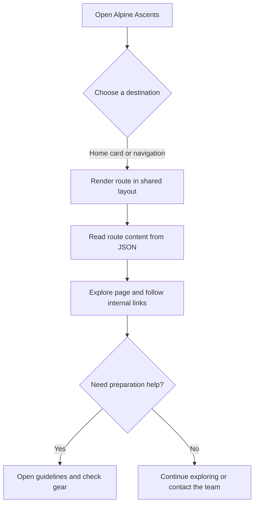
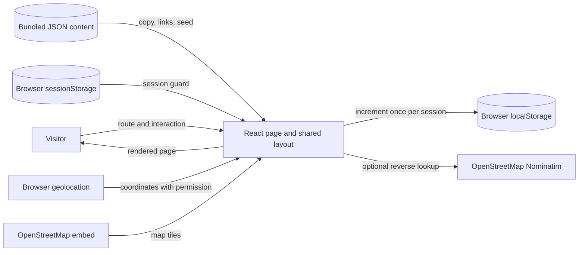

# Alpine Ascents Project Report

## Problem Definition

First-time visitors need a clear introduction to mountaineering, practical safety guidance, and a direct path to relevant topics. The project delivers a responsive React field guide with client-only visitor tracking, current local time/location, image-led section navigation, and a shared layout across direct routes.

## Design Specifications

- **Palette:** forest ink `#18332e`, deep green `#123831`, accent green `#287565`, lime highlight `#d6e89a`, paper `#f5f3e9`, divider `#d8dfd4`.
- **Typography:** DM Sans for interface and body copy; Playfair Display for display headings.
- **Layout:** centered 1200px content; wide directory uses three columns, tablet two, narrow screens one. Header groups six subject links under Explore. The 36px ticker is fixed at the bottom with reserved page padding.
- **Motion and access:** dropdown/mobile navigation fades over 240ms; links expose active/hover/focus/pressed states; Escape closes open menus; reduced-motion preference disables animation.
- **Wireframe:** sticky header with Home, Explore, section links and visitor/logo cluster; mountain hero; mountaineering definition and mission; 12 destination cards; testimonials and call to action; footer; fixed time/location ticker. Inner pages use a topic hero, scannable content, and onward links.

## Flowchart

Prepared as an illustrative design artifact for team review. Raalujah is the requested reviewer/contributor; confirm final attribution with the team before submission.



## Data-Flow Diagram

Prepared as an illustrative design artifact for team review. Derrick is the requested reviewer/contributor; confirm final attribution with the team before submission.



## Source Code and Content

Application source is under `src/`. Route ownership and global design rules are documented in [README.md](README.md). Main implementation areas: `src/App.jsx`, `src/components/Header.jsx`, `src/components/VisitorCounter.jsx`, `src/components/Ticker.jsx`, `src/components/Layout.jsx`, `src/pages/HomePage.jsx`, `src/pages/GuidelinesPage.jsx`, and JSON files in `src/data/`.

Example of the route and seed data shape:

```json
{
  "visitorCountSeed": 1200,
  "header": {
    "nav": [
      { "label": "History", "href": "/history", "group": "explore" },
      { "label": "Guidelines", "href": "/guidelines" }
    ]
  }
}
```

## Test Data

Production commands run from `AlpineAscents/`: `npm install`, `npm run lint`, `npm run build`, then `npm run preview`.

| Page | VS Code embedded Chromium 150 | Chrome | Edge | Firefox | Safari |
| --- | --- | --- | --- | --- | --- |
| Home `/` | Pass | Not verified | Not verified | Not verified | Not available |
| History `/history` | Pass | Not verified | Not verified | Not verified | Not available |
| Types `/types` | Pass | Not verified | Not verified | Not verified | Not available |
| Techniques `/techniques` | Pass | Not verified | Not verified | Not verified | Not available |
| Sheltering `/sheltering` | Pass | Not verified | Not verified | Not verified | Not available |
| Hazards `/hazards` | Pass | Not verified | Not verified | Not verified | Not available |
| Records `/records` | Pass | Not verified | Not verified | Not verified | Not available |
| Clubs `/clubs` | Pass | Not verified | Not verified | Not verified | Not available |
| Success Stories `/success-stories` | Pass | Not verified | Not verified | Not verified | Not available |
| Gallery `/gallery` | Pass | Not verified | Not verified | Not verified | Not available |
| Latest `/latest` | Pass | Not verified | Not verified | Not verified | Not available |
| Guidelines `/guidelines` | Pass | Not verified | Not verified | Not verified | Not available |
| Contact `/contact` | Pass | Not verified | Not verified | Not verified | Not available |
| Unknown route / 404 | Pass | Not verified | Not verified | Not verified | Not available |

**Executed checks:** all 14 direct routes returned HTTP 200 and rendered their expected heading at 360px; all 14 were refreshed at 360px. Home, Records, Success Stories, Gallery, Guidelines, and Contact were checked at 768px and 1280px. No horizontal overflow was measured in 26 route/viewport cases. No browser console errors were observed. All 13 Home images loaded and had non-empty alternative text. The gear checklist updated from 0/10 to 1/10; the visitor count stayed at 1,201 across refresh in the same session; Explore fade/visibility and active History link were checked. Escape was validated with a bubbling keyboard event because this browser harness did not deliver `page.keyboard.press()` events.

Standalone browser binaries were detected, but headless command-line attempts returned no DOM or screenshot output. Chrome, Edge and Firefox are therefore explicitly unverified, not reported as passing. Safari was not available on this Windows environment. A native-browser run remains a submission gate.

## Installation

```powershell
cd AlpineAscents
npm install
npm run dev
```

For production verification, run `npm run build` and `npm run preview`, then visit the printed local URL. The preview server supports refreshing nested SPA routes.

## Sources and Assumptions

- Educational copy and page summaries are maintained in repository JSON. Review mountain conditions, access rules, and safety advice with current official and local sources before real trips.
- Mountain photographs use Unsplash image URLs stored in `src/data/`; network access is required.
- The Records map uses an OpenStreetMap embed. The ticker reverse-geocodes permitted browser coordinates through Nominatim and falls back to rounded coordinates.
- The visitor count is local to a browser, seeded at 1,200, and increments at most once per session. It is not a server-side or global count.

## Submission Checklist

- [x] React source, routes, JSON content, and installation steps.
- [x] Project report, test data, diagrams, and assumptions document.
- [ ] Record a demo video covering navigation states, counter, ticker, each content page, Records map, gallery and mobile layout.
- [ ] Complete native Chrome, Edge, and Firefox testing (and Safari if an Apple device is available).
- [ ] Confirm Raalujah's and Derrick's actual diagram contributions before final attribution.
- [ ] Pull the published `main` before teammates create feature branches.
